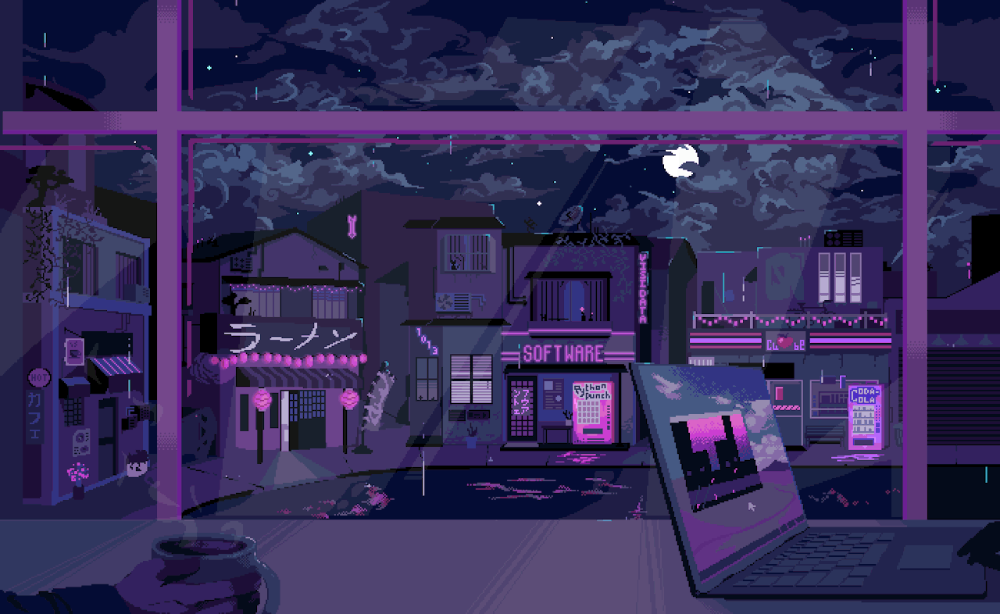

  

<h1>⚛ David Fernandes Ramos</h1>

I'm a Software Engineering student and an aspiring Full Stack Developer. Passionate about technology and problem-solving, I am constantly improving my skills in web development and software engineering.

- 📚 &nbsp; Studying Software Engineering at <a href="https://estacio.br/cursos/graduacao/engenharia-de-software" target="_blank">UNESA - Universidade Estácio de Sá.</a>
   

- 💼 &nbsp; Working as an IT intern at <a href="https://www.angra.rj.gov.br/" target="_blank">Prefeitura Municipal de Angra dos Reis-RJ.</a>

#

<h3 align="left">Connect with me!</h3>

<h3 align="left">Technologies</h3>

  
  
  
  
  
  

  
 
 

---

  <h3>* GitHub Stats *</h3>
   
  

  

#

<picture align="center">
  <source media="(prefers-color-scheme: dark)" srcset="https://raw.githubusercontent.com/DevDavidFernandes/DevDavidFernandes/output/github-contribution-grid-snake-dark.svg">
  <source media="(prefers-color-scheme: light)" srcset="https://raw.githubusercontent.com/DevDavidFernandes/DevDavidFernandes/output/github-contribution-grid-snake-dark.svg">
  
</picture>
